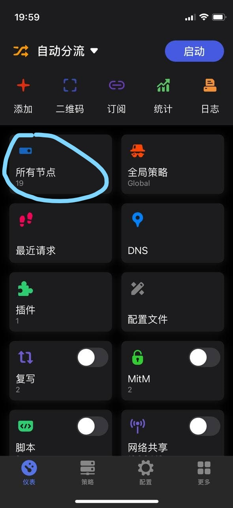
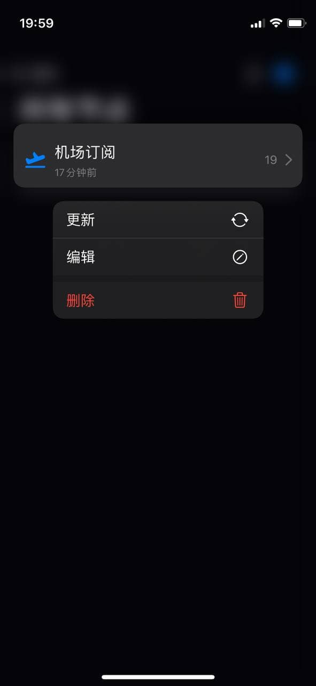
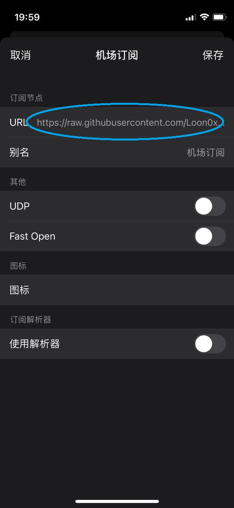

# 配置使用
1.下载配置

复制
https://raw.githubusercontents.com/Skyxim/Loon/master/conf/Loon.conf
到Loon->配置->从URL下载->添加

2.添加订阅

进入点击所有节点,进入节点列表

3.在节点列表中长按机场订阅,并点击编辑

4.将机场订阅的URL修改成自己的订阅链接

5.确保仪表盘左上角选择为自动分流,即可启动Loon

6.选择节点,Loon节点以策略组为核心,所有节点选择在**策略组**中进行,可在策略组为**Global**策略组选择所要使用节点(***仪表盘的所有节点只用于查看,无法切换节点***)

***ps. 为保险起见,完成以上步骤后点击仪表盘->订阅->右上角 进行全部更新保证资源正确被下载***